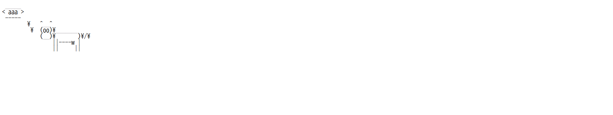
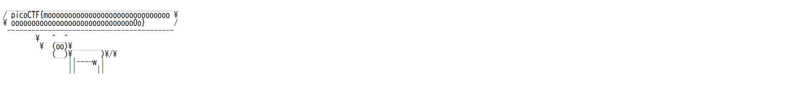

# caas (Web)

# Question
Now presenting cowsay as a service

# Solution
サーバに接続すると、cowsayコマンドでメッセージを表示するために、https://caas.mars.picoctf.net/cowsay/{message}
にリクエストをしろと言われるので、試しに/cowsay/aaaと打つと、cowsayコマンドの結果が表示される。



cowsayコマンドに任意のコマンドを実行させればフラグファイルが読み取れそうだと思ったので調べてみると、

```
cowsay `pwd`
```

というふうにバッククウォートで実行したいコマンドを囲んでcowsayに渡すと、コマンドが実行できることが分かった。

よって、lsコマンドを試したところ、falg.txtが現在のディレクトリに入っていたので、catコマンドで読み取るとフラグが出てきた。



- lsコマンドのリクエスト：cowsay/%60ls%60
- catコマンドのリクエスト：cowsay/%60cat%20falg.txt%60

# Flag
picoCTF{moooooooooooooooooooooooooooooooooooooooooooooooooooooooooooo0o} 